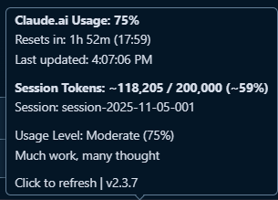
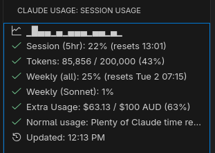
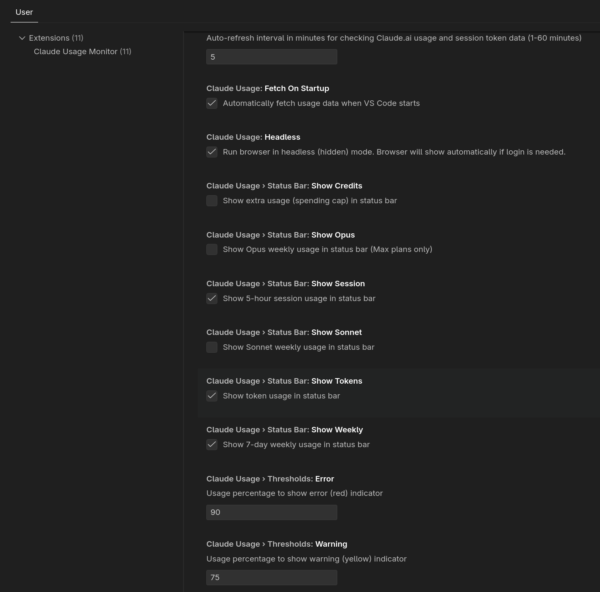

# Claude Usage Monitor

[](https://github.com/sponsors/Gronsten)

Monitor your Claude usage from both Claude.ai web client and Claude Code sessions directly in VS Code. This extension tracks web usage via direct API access (with intelligent fallback to web scraping) and monitors Claude Code token consumption through intelligent session tracking that automatically detects usage from your active conversation, even when multiple conversations are open.

> [!TIP]
> **NEW in v2.3.8:** Professional screenshots added to marketplace listing showcasing status bar integration, detailed tooltips, tree view panel, and configuration settings!

> [!NOTE]
> **Dual Monitoring:** This extension tracks BOTH Claude.ai web usage (5-hour and 7-day limits) AND your Claude Code session token consumption in real-time with intelligent session detection.

## Demo


*See the extension in action: automatic usage fetching, status bar updates, and detailed usage breakdowns*

## Screenshots

### Status Bar Integration


Dual usage display showing both Claude.ai web usage and Claude Code token consumption at a glance.

### Detailed Tooltip


Hover over the status bar for detailed usage information including reset times and usage levels.

### Tree View Panel


Dedicated activity bar panel with comprehensive usage metrics for both 5-hour and 7-day windows.

### Configuration Settings


Simple configuration options for auto-refresh intervals and behavior customization.

## Features

- **Direct API Access** 🚀: Fast, reliable data retrieval using Claude.ai's internal API
  - 2-3x faster than traditional web scraping
  - More reliable (JSON parsing vs HTML regex)
  - Intelligent fallback to HTML scraping if API fails
  - No breaking changes when Claude.ai updates their UI
- **Dual Usage Monitoring**: Track both Claude.ai usage AND development session token usage
  - Claude.ai 5-hour and 7-day usage percentages
  - Current session token count (from `session-data.json`)
  - Automatically updated when developing with Claude Code (see [SESSION_TRACKING.md](SESSION_TRACKING.md))
- **Enhanced Usage Metrics**: Separate tracking for different time windows
  - 5-hour usage limit with reset time
  - 7-day rolling usage with weekly reset
  - Color-coded indicators for both metrics
- **Status Bar Integration**: See both percentages at a glance (e.g., "Claude: 45% | Tokens: 26%")
- **Tree View Panel**: Detailed usage information in a dedicated side panel
- **Configurable Auto-Refresh**: Customizable refresh interval (1-60 minutes, default 5 minutes)
- **Usage Level Indicator**: Shows how much "Claude time" remains (Idle/Light/Moderate/Heavy)
  - Based on max of Claude.ai usage % or session token %
  - Idle (0-24%): Plenty of Claude time! | Light (25-49%): Quarter+ used
  - Moderate (50-79%): Much work, many thought | Heavy (80-100%): Running low!
- **Auto-Start**: Fetches usage data automatically when VS Code starts
- **Silent Mode**: Runs browser in headless (hidden) mode, shows window only if login needed
- **Session Persistence**: Log in once, stay authenticated across VS Code sessions
- **Visual Indicators**: Color-coded warnings when approaching usage limits

## Installation

### Prerequisites

- VS Code 1.80.0 or higher
- Node.js installed (for Puppeteer/Chromium)

### Install from VSIX

1. Download the `.vsix` file
2. Open VS Code
3. Go to Extensions view (`Ctrl+Shift+X`)
4. Click the `...` menu at the top
5. Select "Install from VSIX..."
6. Choose the downloaded file

## First-Time Setup

The extension will **automatically fetch usage data** when VS Code starts. If you haven't logged in before:

1. A browser window will appear (the extension detected you need to log in)
2. Log in to Claude.ai with your credentials (Google, email, etc.)
3. Once logged in, the extension automatically fetches your usage data
4. Your session is saved locally - you won't need to log in again!
5. Future fetches run **silently in the background** (no browser window)

**That's it!** The extension will now:
- Fetch usage automatically on startup
- Refresh at your configured interval (default: every 5 minutes, range: 1-60 minutes)
- Display both Claude.ai and session token usage
- Show your usage level
- Run completely hidden unless login is required

## Usage

### Fetch Usage Data

There are several ways to fetch your usage data:

1. **Click the status bar item** (right side of VS Code)
2. **Use Command Palette** (`Ctrl+Shift+P` / `Cmd+Shift+P`):
   - Search for "Fetch Claude Usage Now"
3. **View the Activity Bar panel**:
   - Click the Claude Usage icon in the Activity Bar (left sidebar)
   - View detailed usage information

### View Usage Information

- **Status Bar**: Shows current usage percentage with a color-coded icon
  - Green check: < 80% usage
  - Orange warning: 80-89% usage
  - Red error: ≥ 90% usage
  - **Hover tooltip** shows:
    - Usage percentage
    - Reset time
    - Last update timestamp
    - Usage level (Idle/Light/Moderate/Heavy)

- **Tree View Panel**: Shows detailed information:
  - Usage percentage
  - Time until reset
  - Last update timestamp

## Configuration

Open VS Code Settings and search for "Claude Usage" to configure:

### `claudeUsage.fetchOnStartup`
- **Type**: Boolean
- **Default**: `true` ✅
- **Description**: Automatically fetch usage data when VS Code starts

### `claudeUsage.headless`
- **Type**: Boolean
- **Default**: `true` ✅
- **Description**: Run browser in headless (hidden) mode. Browser will show automatically if login is needed.

### `claudeUsage.autoRefreshMinutes`
- **Type**: Number
- **Default**: `5`
- **Range**: `1-60` minutes
- **Description**: Auto-refresh interval in minutes for checking Claude.ai usage and session token data

**Recommended Configuration** (`settings.json`):
```json
{
  "claudeUsage.fetchOnStartup": true,
  "claudeUsage.headless": true,
  "claudeUsage.autoRefreshMinutes": 5
}
```

**Example: Custom Refresh Interval** (`settings.json`):
```json
{
  "claudeUsage.fetchOnStartup": true,
  "claudeUsage.headless": true,
  "claudeUsage.autoRefreshMinutes": 15
}
```

## Commands

All commands are available via the Command Palette (`Ctrl+Shift+P` / `Cmd+Shift+P`):

- **`Claude: Fetch Claude Usage Now`** - Manually fetch current usage data
- **`Claude: Open Claude Settings Page`** - Open claude.ai/settings in your default browser

## How It Works

### Automatic Refresh
The extension automatically refreshes usage data at configurable intervals:
- Default: Every 5 minutes
- Customizable: 1-60 minute range
- Updates both Claude.ai usage and session token data
- Runs silently in the background

### Headless Browser Operation
1. The extension uses Puppeteer to launch a Chromium browser
2. On first run, it detects you need to log in (no session cookies found)
3. Browser launches in **visible mode** so you can log in manually
4. Your session is saved to `~/.claude-browser-session/` for future use
5. Subsequent fetches launch browser in **headless mode** (completely hidden)
6. The extension navigates directly to `https://claude.ai/settings/usage`
7. Usage data is extracted from the page and displayed in VS Code
8. Browser closes automatically to save resources

### Session Persistence
- Session cookies are stored locally by Chromium
- No credentials are stored by the extension
- Sessions typically last several weeks before expiring
- If session expires, browser will show again for re-login

## Privacy & Security

- **No credentials stored**: The extension never stores or transmits your credentials
- **Local session only**: Your authentication session is saved locally by Chromium
- **No data transmission**: Usage data stays on your machine
- **Open source**: All code is available for review

## Troubleshooting

### Browser won't launch

**Problem**: Error message "Failed to launch browser"

**Solutions**:
- Ensure you have enough disk space (~500MB for Chromium)
- Check that no antivirus is blocking Puppeteer
- Try running VS Code as administrator (Windows)

### Login timeout

**Problem**: "Login timeout" error after 5 minutes

**Solutions**:
- Complete the login process more quickly
- Check your internet connection
- Try again - the browser window should still be open

### Session expired

**Problem**: Browser keeps asking you to log in

**Solutions**:
- Delete the session folder: `~/.claude-browser-session/`
- Log in again - session should persist this time
- Make sure `headless` mode is `false` during login

### Can't find usage data

**Problem**: "Could not find usage percentage" error

**Solutions**:
- Claude.ai may have changed their settings page layout
- Check if you can see your usage at [claude.ai/settings](https://claude.ai/settings)
- Report an issue for the extension to be updated

### Performance issues

**Problem**: Browser uses too much memory

**Solutions**:
- `headless` mode is enabled by default - browser runs hidden
- The browser closes automatically after fetching to save memory
- Increase `autoRefreshMinutes` to reduce refresh frequency (e.g., 15, 30, or 60 minutes)

## Known Limitations

- Requires Chromium to be downloaded by Puppeteer (~150-200MB)
- Fetch time: 2-10 seconds depending on network speed
- If Claude.ai changes their settings page, the extension may need updates
- Sessions can expire (typically after several weeks of inactivity)

## Feedback & Issues

If you encounter any issues or have suggestions:

1. Check the troubleshooting section above
2. Review open issues on the project repository
3. Submit a new issue with:
   - VS Code version
   - Extension version
   - Error messages from the Output panel (View → Output → Claude Usage Monitor)
   - Steps to reproduce

## Version History

See [CHANGELOG.md](CHANGELOG.md) for version history and updates.

## License

MIT License - See LICENSE file for details

---

**Note**: This is an unofficial extension and is not affiliated with Anthropic or Claude.ai.
